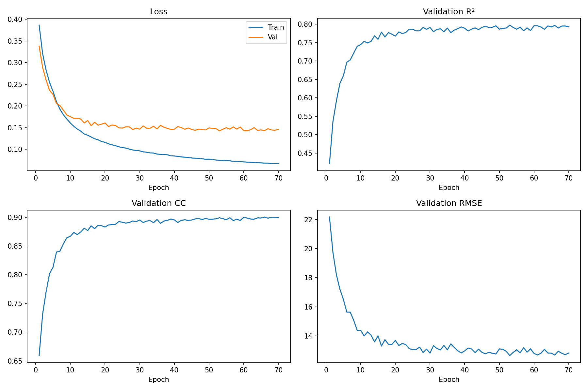

# sEMG-model

Temporal sEMG-to-joint-angle regression using a CNN + attention model on Ninapro-style windowed EMG data.

## Quick start

1. Run preprocessing:
   - `preprocessing.py`
2. Train the model:
   - `train.py`

## Preprocessing

- Raw sEMG is filtered and segmented into fixed windows for supervised learning.
- Windows use `400` samples with a `100` sample stride.
- Repetition-based split is used: train = `[1, 3, 4, 6]`, val = `[2, 5]`.
- EMG inputs are transformed with full-wave `log1p(abs(x))`.
- Inputs and targets are standardized before training.
- Refer to `preprocessing.py` for full details.

## Model overview

- `CNNAttentionImproved` combines convolutional feature extraction with temporal self-attention.
- A circular electrode convolution front-end models spatial structure across the 12 EMG channels.
- Multi-scale 1D convolutions capture short and longer temporal patterns before attention.
- Stacked attention blocks model temporal dependencies across the EMG window.
- A kinematic coupling head predicts 22 joint angles while learning output correlations.
- Refer to `model.py` for full architecture details.

## Current best checkpoint

- Checkpoint: [outputs_v9_best/best_model.pt](outputs_v9_best/best_model.pt)
- Config: [outputs_v9_best/config.json](outputs_v9_best/config.json)
- History: [outputs_v9_best/history.json](outputs_v9_best/history.json)

### Best validation stats

| Metric | Value |
|---|---:|
| Val $R^2$ | 0.7978 |
| Val CC | 0.9007 |
| Val RMSE | 12.7218 |
| Val loss | 0.1424 |
| Train $R^2$ at best epoch | 0.9248 |

### Learning curve

### Best model config

#### Data / preprocessing

| Setting | Value |
|---|---:|
| Window size | 400 |
| Step size | 100 |
| EMG channels | 12 |
| Output joints | 22 |
| Train samples | 264,838 |
| Val samples | 132,330 |
| EMG transform | `log1p(abs(x))` |
| Input mode | `raw` |
| Input scaler | `standard` |
| Target scaler | `standard` |
| Target lag | 1 |

#### Model

| Setting | Value |
|---|---:|
| Architecture | `CNNAttentionImproved` |
| Hidden size | 256 |
| Attention blocks | 4 |
| Attention heads | 4 |
| Parameters | 3,935,114 |
| Dropout | 0.15 |

#### Training

| Setting | Value |
|---|---:|
| Batch size | 256 |
| Epochs | 150 |
| Learning rate | 5e-4 |
| Min LR | 3e-5 |
| Warmup epochs | 5 |
| Weight decay | 3e-4 |
| Optimizer | `AdamW` |
| Scheduler | `CosineAnnealingLR` |
| Loss | `SmoothL1Loss(beta=0.5)` |
| Checkpoint selection | `r2` |
| Lag sweep | disabled |
