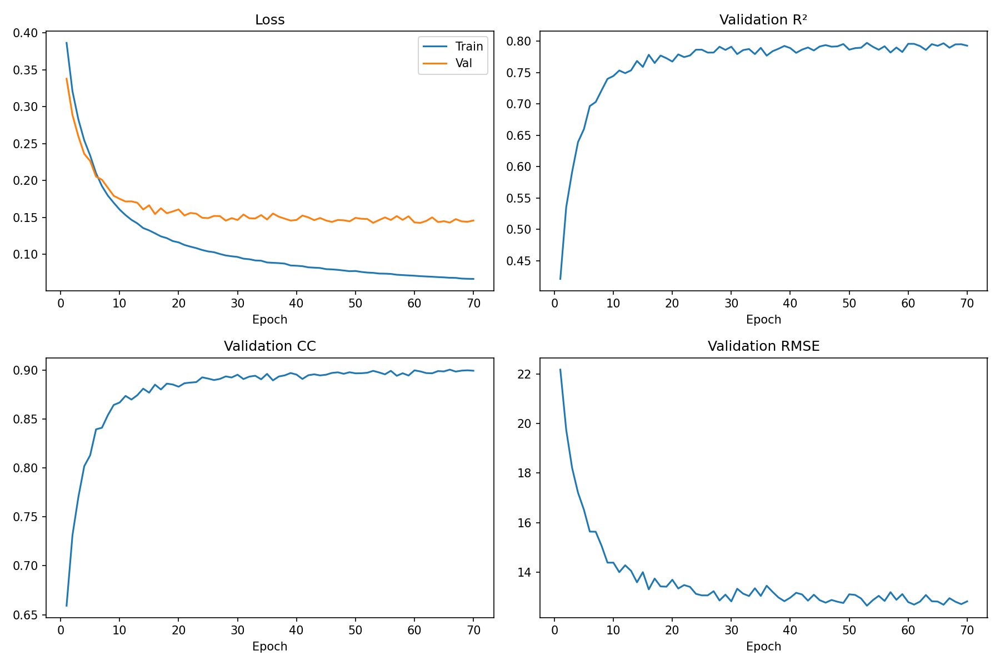

# sEMG-model

Temporal sEMG-to-joint-angle regression using a CNN + attention model on Ninapro-style windowed EMG data. Will be adapted for real-time prediction using our own markerless-mocap + sEMG sleeve data pipeline.  

## Installation

```bash
# Create and activate the environment
conda create -n semg python=3.11 -y
conda activate semg

# Install PyTorch — pick the right CUDA build from https://pytorch.org/get-started/locally/
# Example for CUDA 12.1:
pip install torch --index-url https://download.pytorch.org/whl/cu121

# All other dependencies:
pip install -r requirements.txt
```

## Dataset download — NinaPro DB2 (subjects 1–15)

The model uses the pre-processed NinaPro DB2 dataset. Each subject is a separate zip that extracts to a folder containing `.mat` files.

Run the following from the **repo root** (requires `wget` and `unzip`):

```bash
mkdir -p ninapro/data
cd ninapro/data

for i in $(seq 1 15); do
    wget https://ninapro.hevs.ch/files/DB2_Preproc/DB2_s${i}.zip
    unzip DB2_s${i}.zip
    rm DB2_s${i}.zip
done

cd ../..
```

After this step `ninapro/data/` should contain 15 folders:

```
ninapro/data/
    DB2_s1/
    DB2_s2/
    ...
    DB2_s15/
```

> **Note:** `ninapro/data/` and `ninapro/processed data/` are listed in `.gitignore` and are not tracked.

## Quick start

1. Download dataset (see above).
2. Run preprocessing from inside the `ninapro/` directory:
   ```bash
   cd ninapro
   python preprocessing.py --db_dir data --output_dir "processed data"
   ```
4. Train the basic GRU model:
   ```bash
   python train_gru.py
   ```
3. Train the CNN-AttentioN Improved model:
   ```bash
   python train.py
   ```

*Note* : the sleeve model data is not made available as it is still being and going througb various improvements. The Ninapro DB2 dataset is used as a benchmark for model development and will be replaced with our own data once the pipeline is finalized.

## Preprocessing

- Raw sEMG is filtered and segmented into fixed windows for supervised learning.
- Windows use `400` samples with a `100` sample stride.
- Repetition-based split is used: train = `[1, 3, 4, 6]`, val = `[2, 5]`.
- EMG inputs are transformed with full-wave `log1p(abs(x))`.
- Inputs and targets are standardized before training.
- Refer to `preprocessing.py` for full details.

## Model overview

- `CNNAttentionImproved` combines convolutional feature extraction with temporal self-attention.
- A circular electrode convolution front-end models spatial structure across the 12 EMG channels.
- Multi-scale 1D convolutions capture short and longer temporal patterns before attention.
- Stacked attention blocks model temporal dependencies across the EMG window.
- A kinematic coupling head predicts 22 joint angles while learning output correlations.
- Refer to `model.py` for full architecture details.

## Current best checkpoint

- Checkpoint: [outputs_v9_best/best_model.pt](outputs_v9_best/best_model.pt)
- Config: [outputs_v9_best/config.json](outputs_v9_best/config.json)
- History: [outputs_v9_best/history.json](outputs_v9_best/history.json)

### Best validation stats

| Metric | Value |
|---|---:|
| Val $R^2$ | 0.7978 |
| Val CC | 0.9007 |
| Val RMSE | 12.7218 |
| Val loss | 0.1424 |
| Train $R^2$ at best epoch | 0.9248 |


### Learning curve




### Best model config

#### Data / preprocessing

| Setting | Value |
|---|---:|
| Window size | 400 |
| Step size | 100 |
| EMG channels | 12 |
| Output joints | 22 |
| Train samples | 264,838 |
| Val samples | 132,330 |
| EMG transform | `log1p(abs(x))` |
| Input mode | `raw` |
| Input scaler | `standard` |
| Target scaler | `standard` |
| Target lag | 1 |

#### Model

| Setting | Value |
|---|---:|
| Architecture | `CNNAttentionImproved` |
| Hidden size | 256 |
| Attention blocks | 4 |
| Attention heads | 4 |
| Parameters | 3,935,114 |
| Dropout | 0.15 |

#### Training

| Setting | Value |
|---|---:|
| Batch size | 256 |
| Epochs | 150 |
| Learning rate | 5e-4 |
| Min LR | 3e-5 |
| Warmup epochs | 5 |
| Weight decay | 3e-4 |
| Optimizer | `AdamW` |
| Scheduler | `CosineAnnealingLR` |
| Loss | `SmoothL1Loss(beta=0.5)` |
| Checkpoint selection | `r2` |
| Lag sweep | disabled |

---

## sEMG Sleeve pipeline

The `sEMG_sleeve/` sub-package trains and deploys a live-inference model using our own sEMG sleeve hardware and markerless mocap ground truth. Raw data is recorded with Lab Streaming Layer (LSL) and saved as `.xdf` files.

> **Note:** sleeve data files are not publicly distributed — they live in `sEMG_sleeve/data/` which is gitignored.

### Directory layout

```
sEMG_sleeve/
    data/                       # raw .xdf recordings (not tracked)
    processed data/             # windowed .npz files (not tracked)
    augmented data/             # rotation-augmented .npz files (not tracked)
    sleeve_preprocessing.py     # XDF → windowed .npz
    augment_processed_data.py   # ring-rotation augmentation
    sleeve_model.py             # SleeveCNNAttentionImproved + loss
    sleeve_TCN_model.py         # SleeveTCNRegressor (alternative)
    sleeve_geometry_model.py    # geometry-aware variant
    sleeve_train.py             # training loop
    outputs_v16_best/           # current best checkpoint
    visualization/
        sEMG_inference.py       # XDF replay → UDP angle stream
        handtrack_data_handler.py  # UDP relay to Unity
        Right_Hand_Listener_sEMG.cs  # Unity predicted-hand script
        Right_Hand_Listener_GT.cs    # Unity ground-truth-hand script
```

### 1. Preprocess raw XDF recordings

Place `.xdf` files in `sEMG_sleeve/data/`, then run from `sEMG_sleeve/`:

```bash
cd sEMG_sleeve
python sleeve_preprocessing.py --db_dir data --output_dir "processed data"
```

Key options:

| Flag | Default | Description |
|---|---|---|
| `--db_dir` | `data` | Folder containing `.xdf` files |
| `--output_dir` | `processed data` | Output folder for `.npz` files |
| `--window_len` | `200` | Window length in samples (100 ms @ 2 kHz) |
| `--step_len` | `50` | Step length in samples (25 ms) |
| `--train_fraction` | `0.8` | Train/val split fraction |
| `--emg_stream` | `OpenEphys_EMG` | LSL stream name for EMG |
| `--angle_stream` | `StereoHandTracker_Angles` | LSL stream name for angles |

### 2. (Optional) Augment training data

Applies ring-rotation augmentation to all `*_train.npz` files and copies val files unchanged:

```bash
python augment_processed_data.py
```

Reads from `processed data/`, writes to `augmented data/` by default.

### 3. Train the sleeve model

```bash
python sleeve_train.py
```

Checkpoint and training curves are saved to `outputs/` (configurable at the top of `sleeve_train.py`). The current best checkpoint is in `outputs_v16_best/`.

---

### Live inference + Unity visualization

The visualization pipeline replays a raw `.xdf` file through the trained model and streams predicted and ground-truth joint angles to a Unity scene side-by-side.

### Live LSL inference from Open Ephys

For realtime prediction from the Open Ephys LSL bridge, use the sleeve live-inference app in `sEMG_sleeve/visualization/`.

Run order:

```bash
# 1. Start Open Ephys GUI with ZMQ Interface enabled

# 2. Start the Open Ephys -> LSL bridge
cd python-open-ephys/examples/joint_angle_regression
python open_ephys_lsl_streamer.py --no-gui --emg-stream-name OpenEphys_EMG

# 3. Optional: start hand tracking if you want live ground-truth angles on LSL
# Expected stream name: StereoHandTracker_Angles

# 4. Start the Unity forwarder / UDP bridge
cd sEMG-model/sEMG_sleeve/visualization
python handtrack_data_handler.py

# 5. Start live EMG -> joint-angle inference
python sEMG_live_lsl_inference.py \
    --emg-stream OpenEphys_EMG \
    --pred-lsl-stream PredictedJointAngles
```

Notes:
- The default sleeve checkpoint in `outputs_v16_best/` expects `128` EMG channels and `200` model-domain samples per prediction window.
- The live app reads the incoming LSL sample rate, resamples each live window onto the model window size when needed, and emits predicted angles over UDP port `5020`.
- For quick validation of the predicted-angle LSL stream, use `Hand-Landmark-Tracker/examples/01_basic_tracking/lsl_jointangles_visualizer.py --stream-name PredictedJointAngles`.

#### Port map

| Stream | Port |
|---|---:|
| Predicted angles (inference → handler) | 5020 |
| Ground-truth angles (inference → handler) | 5025 |
| Predicted hand (handler → Unity) | 5016 |
| Ground-truth hand (handler → Unity) | 5017 |

#### Run order

**1.** Open the Unity scene with the predicted hand (green) and ground-truth hand (red) rigs, each with its UDP listener component attached.

**2.** Start the data handler (from `sEMG_sleeve/visualization/`):

```bash
cd sEMG_sleeve/visualization
python handtrack_data_handler.py
```

**3.** Start inference playback:

```bash
# Specific subject and session
python sEMG_inference.py --subject 3 --session 2

# Subject only — picks a random matching session
python sEMG_inference.py --subject 4

# Explicit XDF file
python sEMG_inference.py --xdf-file ../data/sub-001_ses-002.xdf
```

The script loads the model from `outputs_v16_best/` by default. Pass `--model-dir` to override.

